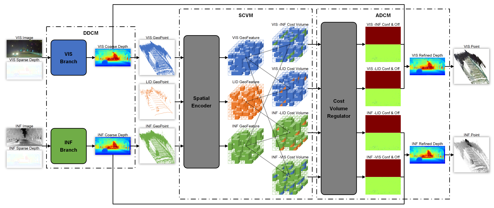

# VIL-PPGen: A Novel Pseudo Point Generator Based on Visible Light Camera, Infrared Camera and Lidar

This repository is the official implementation of [VIL-PPGen: A Novel Pseudo Point Generator Based on Visible Light Camera, Infrared Camera and Lidar]().





## Setup

Please setup the environment according to the [script](./setup_environment.sh ).

```bash
conda create -n VIL-PPGen python=3.9

conda activate VIL-PPGen

conda install pytorch==2.0.1 torchvision==0.15.2 torchaudio==2.0.2 pytorch-cuda=11.7 -c pytorch -c nvidia

conda install pandas matplotlib tqdm scipy scikit-learn rich openpyxl

pip install opencv-python tensorboard pyyaml

pip install open3d==0.16.0

pip install spconv-cu117

python setup.py develop
```


## Data Preparation

You can download data and weights for demonstration through the [link](https://drive.google.com/drive/folders/1eh5lzMhMUwQj_cG4l-9wphO0Rlr9tOe7?usp=drive_link). Just put them in the project folder.

Note: due to confidentiality, the whole dataset is not available now.


## Inference

After preparing data and weights, you can run the following code:

```bash
cd ./tools
python infer.py 
```


